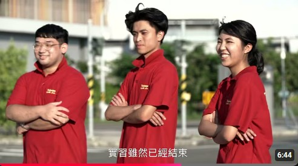

# DisplayTony
show some results
- 項目1：[健康叮嚀小天使APP (可於智慧型手機執行之水果物件辨識)](https://youtu.be/GvsNPLzUvQg)

- 項目2：基於YoLo & DeepSort之物件追蹤 [1.車輛](https://youtu.be/l5ahsCPko4s) [2.行人](https://youtu.be/y1Zv07FIMk0)

- 項目3：[自駕車路口緊急避讓](https://youtu.be/AaqckTvClVg)

- 項目4：[實習生的筆記本節目拍攝](https://youtu.be/FsgdbukNgEY?si=3-YY52wmtj8qfmUd&t=132) [實習生的筆記本PodCast拍攝](https://www.youtube.com/watch?v=8VfCMFU1eds&list=PLIUx-rz1y4R6h9U5_A8Of8rcHomr8WE_1&index=7)

