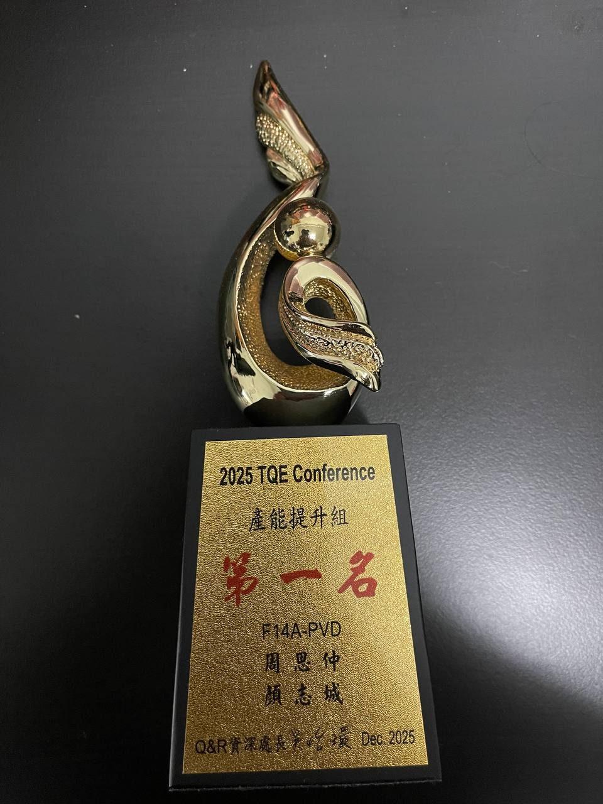
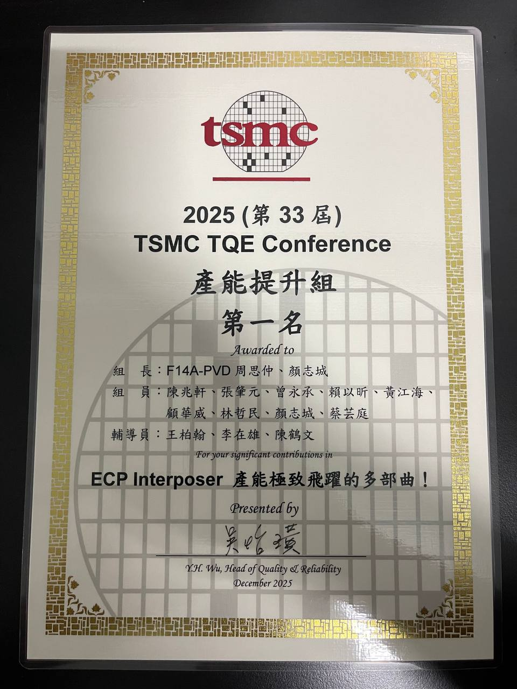

# 顏志城(Tony)
熱愛電腦科學的探索者。我專注於將理論與實踐相結合，創造有意義的技術應用。

# 作品集
以下是我曾開發的部分專案。我會持續擴充這個清單，特別是在大語言模型、AI Agent和情緒分析領域的新作品。

- 項目1：[基於時空圖注意力及分層式強化學習之自駕決策與控制系統設計](https://youtu.be/AaqckTvClVg)
- 
  首先以圖注意力機制(GAT)對環境進行編碼(理解層)，接著使用分層強化學習(HRL)分別進行路徑與控制的決策。

- 項目2：[建立你的地圖 (BYT)](https://youtube.com/shorts/z-BBTMzqENE?feature=share)
- 
  基於LLM開發的旅遊小助手，以自然語言方式快速協助旅人安排行程，且提供多個旅程存檔，可做為日後回憶。

  
- 項目3：[健康叮嚀小天使APP (可於智慧型手機執行之水果物件辨識)](https://youtu.be/GvsNPLzUvQg)
- 
  使用輕量化模型實現可運作於本地端行動裝置之物件辨識案例。

# 榮耀事蹟
在台灣積體電路製造股份有限公司(Taiwan Semiconductor Manufacturing Company Limited - TSMC)任職時，基於YOLO演算法開發Wafer Edge Bevel Detect，首創Wafer EBR dataset 及 動態圓演算法，成功提升產能並獲得33屆TSMC TQE Conference第一名肯定

# 媒體參與
我曾有機會參與自駕車相關科普電視節目的拍攝。這段經歷不僅讓我能夠分享專業知識，也讓我體驗到科技傳播的樂趣與重要性。

- 項目1：[實習生的筆記本節目拍攝](https://youtu.be/FsgdbukNgEY?si=3-YY52wmtj8qfmUd&t=132) [實習生的筆記本PodCast拍攝](https://www.youtube.com/watch?v=8VfCMFU1eds&list=PLIUx-rz1y4R6h9U5_A8Of8rcHomr8WE_1&index=7)

# 聯絡方式
- Email：a01010508s@gmail.com

